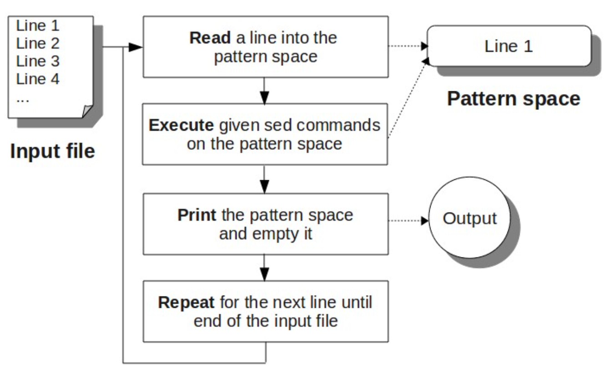

# 2. Sed Scripting Flow

Sed scripting follows the easily remembered sequence **Read**, **Execute**, **Print**, **Repeat**. **(REPR)**

- **Read** a line into the pattern space.
- **Execute** the sed command on the line in the sed pattern space.
- **Print** the line from the pattern space. After print, the sed pattern space will be empty. 
- **Repeat** this again until the end of the input file is reached.

