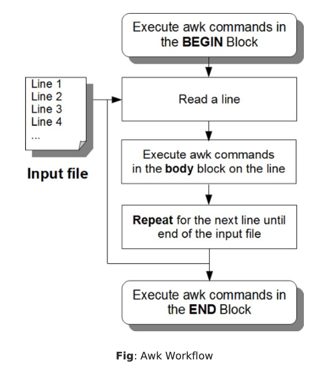

# 52. Awk Program Structure (BEGIN, body, END block)

## 1. BEGIN Block

### Syntax of begin block

`BEGIN { awk-commands }`

- The BEGIN block is a good place to print report headers, and initialize variables.
- You can have one or more awk commands in the BEGIN block.
- The keyworld BEGIN should be specified in upper case.
- BEGIN block is optional.

## 2. Body Block

### Syntax of body block

`/pattern/ {action}`

- Body block gets executed once for every line in the input file.
- There is no keyword for the body block.

## 3. END Block

### Syntax of END block

`END { awk-commands }`

- The END block is a good place to print a report footer and do any clean-up activities.
- You can have one or more awk commands in the END block.
- The keyworld END should be specified in upper case.
- END block is optional.

`awk 'BEGIN { FS=":"; print "---header---" } \  
/mail/ {print $1} \  
END { print "---footer---" }' /etc/passwd`

Write a script file instead on command line

`
BEGIN {
    FS=":"
    print "---header---"
}
/mail/ {
    print $1
}
END {
    print "---footer---"
}
`  

Some random simple examples with various combinations of awk blocks.

#### Only the body block:
`awk -F: '{ print $1 }' /etc/passwd`

#### BEGIN, body, and END block:
`awk -F: 'BEGIN { printf "username\n------\n" } \
{ print $1 }
END { print "------" }' /etc/passwd`

#### BEGIN, and body block:
`awk -F: 'BEGIN { print "UID" } { print $3 }' /etc/passwd`
