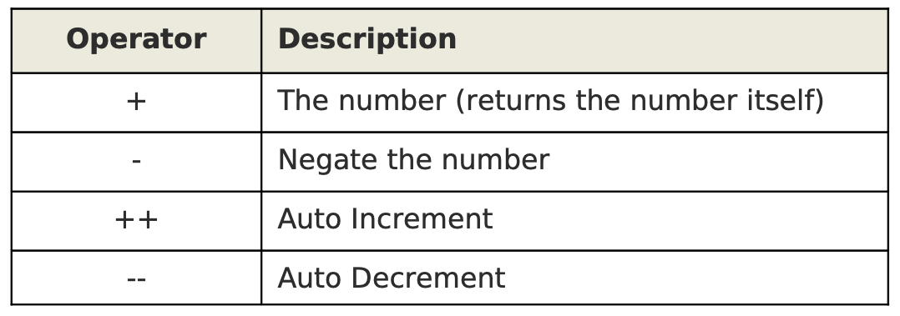

# 63. Unary Operators



The following statement negates the number using unary operator minus:  
`awk -F, '{ print -$4 }' employee-sal.txt`

The following statement demonstrates how plus and minus unary operators affect negative numbers.

```
vim negative.txt
-1
-2
-3

awk '{ print +$1 }' negative.txt

awk '{ print -$1 }' negative.txt
```

## Auto Increment and Auto Decrement

### Example of pre-auto-increment

`awk -F, '{ print ++$4 }' employee-sal.txt`

### Example of pre-auto-decrement

`awk -F, '{ print --$4 }' employee-sal.txt`

### Example of post-auto-increment

(since ++ is in the print statement the original value is printed)  
`awk -F, '{ print $4++ }' employee-sal.txt`

### Example of post-auto-increment

(since ++ is in a separator statement the resulting value is printed)  
`awk -F, '{ $4++; print $4 }' employee-sal.txt`

### Example of post-auto-decrement

(since -- is in the print statement the original value is printed)  
`awk -F, '{ print $4-- }' employee-sal.txt`

### Example of post-auto-decrement

(since -- is in a separator statement the resulting value is printed)  
`awk -F, '{ $4--; print $4 }' employee-sal.txt`

The following script displays the total number of users who have a login shell.  
`awk -F ':' '$NF ~ /\/bin\/bash/ { n++ } END { print n }' /etc/passwd`
