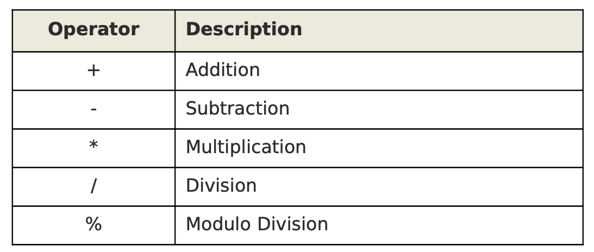

# 64. Arithmetic Operators



The following example does two things:
1. Reduces the price of every single item by 20%
1. Reduces the quantity of every single item by 1

```
vi arithmetic.awk

BEGIN {
    FS=",";
    OFS=",";
    item_discount=0;
}
{
    item_discount=$4*20/100;
    print $1, $2, $3, $4-item_discount, $5-1
}

awk -f arithmetic.awk items.txt
```

The following example prints all the even numbered lines from the input file.  
`awk 'NR % 2 == 0' items.txt`
