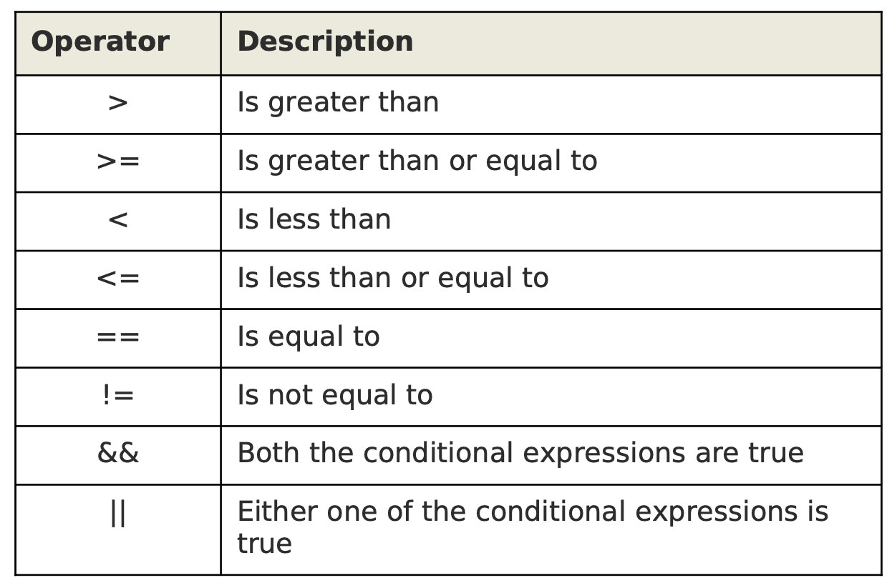

# 67. Comparison Operators



**Note:** If you don't sepcify any action, awk will print the whole record if it matches the conditional comparison.

The following example displays all the items that are under the critical inventory level of 5:  
`awk -F "," '$5 <= 5' items.txt`

The following example uses == condition:  
`awk -F "," '$1==103' items.txt`

Print only the description of the item with number 103:  
`awk -F "," '$1==103 { print $2 }' items.txt`

The following example uses != condition:  
`awk -F "," '$3 != "Video"' items.txt`

Print only the item description:  
`awk -F "," '$3 != "Video" { print $2 }' items.txt`

The following example uses && to check two conditions.  
`awk -F "," '$4 < 900 && $5 <= 5' items.txt`

Print only the item description:  
`awk -F "," '$4 < 900 && $5 <= 5 { print $2 }' items.txt`

The following example uses || to check two conditions.  
`awk -F "," '$4 < 900 || $5 <= 5' items.txt`

Print only the item description:  
`awk -F "," '$4 < 900 || $5 <= 5 { print $2 }' items.txt`

The following example uses > condition to print the max uid and the line.  
```
awk -F ':' '$3 > maxuid { maxuid=$3; maxline=$0 }
END { print maxuid, maxline }' /etc/passwd
```

The following example uses == condition to print the line only if user id and group id are equal.  
`awk -F ':' '$3 == $4' /etc/passwd`

The following example uses >= and && conditions to print lines where user id >= 100 and user's shell is /bin/sh.  
`awk -F ':' '$3>=100 && $NF ~ /\/bin\/sh/' /etc/passwd`

The following example uses == condition to print lines that doesn't have a comment.  
`awk -F ":" '$5 == ""' /etc/passwd`
