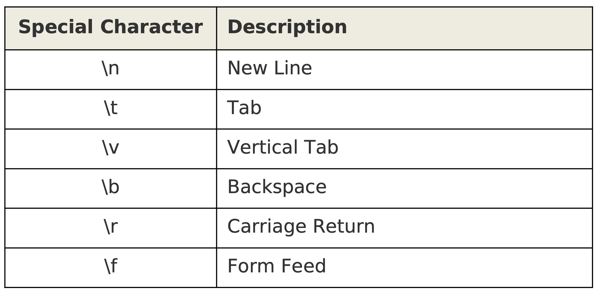
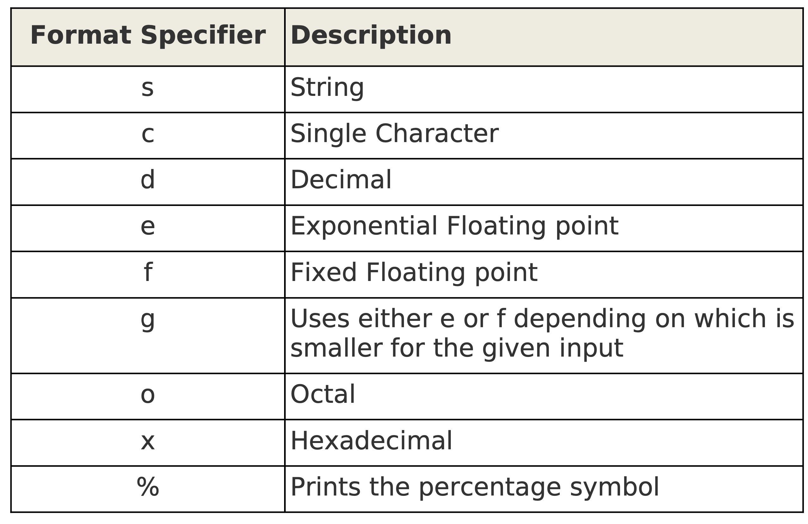

# 85. Pretty Printing Using printf

## Synatx
`printf "print format", variable1, variable2, etc.`

## Special Characters in the printf Format


The following script prints multiple lines:  
`awk 'BEGIN { printf "Line1\nLine2\n" }'`

The following prints different fields separated by tabs:  
`awk 'BEGIN { printf "Field 1\t\tField 2\tField 3\tField 4\n" }'`

The following prints vertical tabs after every field:  
`awk 'BEGIN { printf "Field 1\vField 2\vField 3\vField 4\n" }'`

The following prints a backspace after every field except Field 4:  
`awk 'BEGIN {printf "Field 1\bField 2\bField 3\bField 4\n" }'`

The following prints only Field 4:  
`awk 'BEGIN { printf "Field 1\rField 2\rField 3\rField 4\n" }'`

## Print Uses OFS, ORS Values
```
cat print.awk
BEGIN {
    FS=",";
    OFS=":";
    ORS="\n--\n";
}
{
    print $2, $3;
}

awk -f print.awk items.txt
```

## Printf doesn't Use OFS, ORS Values
```
cat printf1.awk
BEGIN {
    FS=",";
    OFS=":";
    ORS="\n--\n";
}
{
    printf "%s^^%s\n\n", $2, $3;
}

awk -f printf1.awk items.txt
```

## Printf Format Specifiers


The following shows the basic usage of format specifiers:
```
cat printf-format.awk
BEGIN {
    printf "s--> %s\n", "String";
    printf "c--> %c\n", "String";
    printf "s--> %s\n", 101.23;
    printf "d--> %d\n", 101.23;
    printf "e--> %e\n", 101.23;
    printf "f--> %f\n", 101.23;
    printf "g--> %g\n", 101.23;
    printf "o--> %o\n", 0x8;
    printf "x--> %x\n", 16;
    printf "percentage--> %%\n", 17;
}
```

## Print with Fixed Column Width (Basic)

The following shows the basic use of number sepcified immediately after %:
```
cat printf-width.awk
BEGIN {
    FS=",";
    printf "%3s\t%10\t%10s\t%5s\t%3s\n",
    "Num", "Description", "Type, "Price", "Qty"
}
{
    printf "%3d\t%10s\t%10s\t%g\t%d\n", $1, $2, $3, $4, $5;
}

awk -f printf-width.awk items.txt
```

Spaces are added to the left by default.  
`awk 'BEGIN { printf "%6s\n", "Good" }'`

The whole string printed if the text is longer than specified number.  
`awk 'BEGIN { printf "%6s\n", "Good Boy!" }'`

## Print with Fixed Width (Left Justified)

"%6s" is right justified as show below:  
`awk 'BEGIN { printf "|%6s|", "Good" }'`

"%6s" is left justified as show below:  
`awk 'BEGIN { printf "|%-6s|", "Good" }'`

## Print with Dollar Amount
```
cat printf-width2.awk
BEGIN {
    FS=",";
    printf "%-3s\t%-10\t%-10s\t%-5s\t%-3s\n",
    "Num", "Description", "Type, "Price", "Qty"
}
{
    printf "%-3d\t%-10s\t%-10s\t$%-.2f\t%-d\n", $1, $2, $3, $4, $5;
}

awk -f printf-width2.awk items.txt
```

## Print with Leading Zeros 
`awk 'BEGIN { printf "|%5d|\n", "100" }' ==> |  100|`

Right justified with 0s in front of the number:  
`awk 'BEGIN { printf "|%05d|\n", "100" } ==> |00100|'`

The following script uses leading zero format identifier for Qty field.
```
cat printf-width3.awk
BEGIN {
    FS=",";
    printf "%-3s\t%-10\t%-10s\t%-5s\t%-3s\n",
    "Num", "Description", "Type, "Price", "Qty"
}
{
    printf "%-3d\t%-10s\t%-10s\t$%-.2f\t%03d\n", $1, $2, $3, $4, $5;
}

awk -f printf-width3.awk items.txt
```

## Print Absolute Fixed Width String Value

The following script prints maximum of ONLY 6 characters.  
`awk 'BEGIN { printf "%.6s\n", "Good Boy!" }'`

The reiiable way to print a fixed character:  
`awk 'BEGIN { printf "%6s\n", substr("Good Boy!", 1, 6) }'`

## Dot . Precision
```
vim dot.awk
BEGIN {
    print "----Using .1----";
    printf ".1d--> %.1d\n", 101.23;
    printf ".1e--> %.1e\n", 101.23;
    printf ".1f--> %.1f\n", 101.23;
    printf ".1g--> %.1g\n", 101.23;
    print "----Using .4----";
    printf ".4d--> %.4d\n", 101.23;
    printf ".4e--> %.4e\n", 101.23;
    printf ".4f--> %.4f\n", 101.23;
    printf ".4g--> %.4g\n", 101.23;
}

awk -f dot.awk
```

## Print Report to File
```
cat printf-width4.awk
BEGIN {
    FS=",";
    printf "%-3s\t%-10\t%-10s\t%-5s\t%-3s\n",
    "Num", "Description", "Type, "Price", "Qty" > "report.txt";
    printf "------------------------------\n" >> "report.txt";
}
{
    printf "%-3d\t%-10s\t%-10s\t$%-.2f\t%03d\n", $1, $2, $3, $4, $5 >> "report.txt";
}

awk -f printf-width3.awk items.txt
```

The other method is not to use ">" and ">>", instead redirect the output to a file.
```
cat printf-width5.awk
BEGIN {
    FS=",";
    printf "%-3s\t%-10\t%-10s\t%-5s\t%-3s\n",
    "Num", "Description", "Type, "Price", "Qty"
}
{
    if ($5 > 10)
    {
        printf "%-3d\t%-10s\t%-10s\t$%-.2f\t%03d\n", $1, $2, $3, $4, $5;
    }
}

awk -f printf-width5.awk items.txt > report.txt
```
